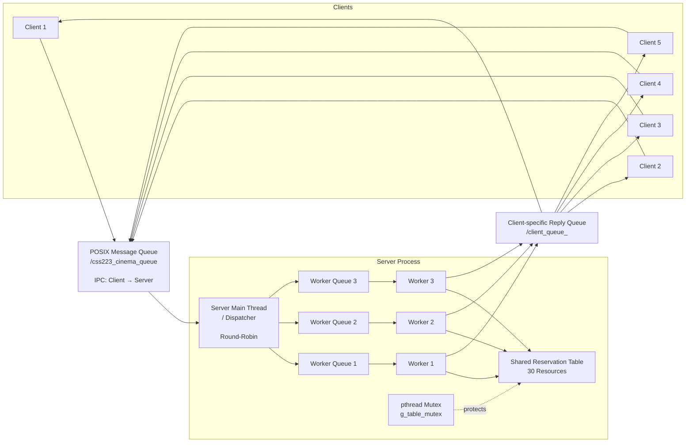

# OS-PROJECT
# CSS223 Cinema Reservation Project

ระบบจองที่นั่งโรงภาพยนตร์แบบ Concurrent พัฒนาด้วยภาษา **C** และ **POSIX Message Queue**

## 1. ภาพรวมโครงงาน

โครงงานนี้เป็นการพัฒนาระบบจองที่นั่งโรงภาพยนตร์แบบ Concurrent ด้วยภาษา C บน Linux/Docker โดยใช้ **POSIX Message Queue** เป็นกลไก IPC หลักสำหรับการสื่อสารระหว่าง Client หลายตัวกับ Server

Server ประกอบด้วย **Server Main Thread / Dispatcher** และ Worker threads หลายตัวเพื่อประมวลผลคำขอพร้อมกัน ระบบมีตารางการจองที่นั่งร่วมกัน (**Shared Reservation Table**) และใช้ **pthread mutex** เพื่อป้องกัน Race Condition เมื่อเปิดโหมด Synchronization

ระบบมีโหมด `nosync` สำหรับปิด mutex โดยตั้งใจ เพื่อใช้สาธิต Race Condition ตามการทดลองของโครงงาน

### ความสามารถหลัก

- มีที่นั่ง/ทรัพยากรที่จองได้ 30 รายการ (`1-30`)
- รองรับ Client หลายตัว
- รองรับ Worker อย่างน้อย 3 ตัว
- ใช้ POSIX Message Queue สำหรับการสื่อสาร Client -> Server
- มี POSIX Message Queue แยกสำหรับรับคำตอบของแต่ละ Client
- มี Server Main Thread / Dispatcher
- มี Internal Worker Queue แยกสำหรับแต่ละ Worker
- กระจายงานแบบ Round-Robin
- มี Shared Reservation Table
- ใช้ Mutex สำหรับ Synchronization
- มี Random Delay 50-500 ms สำหรับการทดลอง Race Condition
- Server มี Log ที่แสดง Sequence Number, Worker ID, Client ID, Command, Resource ID และเหตุการณ์ใน Critical Section
- ทำงานบน Docker/Linux

---

## 2. สถาปัตยกรรมระบบ

ระบบแบ่งการทำงานออกเป็น 2 ส่วนหลัก ได้แก่ **Request Path** สำหรับส่งคำขอจาก Client ไปยัง Worker และ **Response Path** สำหรับส่งผลลัพธ์กลับไปยัง Client

### 2.1 ภาพรวม Architecture



### 2.2 ลำดับการทำงาน

**Request**

```text
Client
   ↓
POSIX Message Queue
   ↓
Server Main Thread / Dispatcher
   ↓
Worker Queue
   ↓
Worker Thread
   ↓
Shared Reservation Table
```

**Response**

```text
Worker Thread
   ↓
Client-specific Reply Queue
   ↓
Client
```

### 2.3 หน้าที่ของแต่ละส่วน

| ส่วนประกอบ | หน้าที่ |
|---|---|
| **Client** | รับคำสั่งจากผู้ใช้และส่ง Request ไปยัง Server |
| **POSIX Message Queue** | เป็น IPC หลักสำหรับส่ง Request จาก Client ไปยัง Server |
| **Server Main Thread / Dispatcher** | รับ Request จาก Server Queue และกระจายงานให้ Worker แบบ Round-Robin |
| **Worker Queue 1–3** | เก็บ Request สำหรับ Worker แต่ละตัวภายใน Server Process |
| **Worker 1–3** | ประมวลผล Command เช่น `LIST`, `STATUS`, `RESERVE`, `CANCEL`, `QUIT` |
| **Shared Reservation Table** | เก็บสถานะและเจ้าของทรัพยากรที่ใช้ร่วมกันโดย Worker ทุกตัว |
| **pthread Mutex** | ป้องกัน Critical Section ของ Shared Reservation Table |
| **Client-specific Reply Queue** | ส่งผลลัพธ์จาก Worker กลับไปยัง Client ที่ส่ง Request |

### 2.4 การกระจายงานของ Dispatcher

Dispatcher ใช้ **Round-Robin** เพื่อกระจาย Request ไปยัง Worker:

```text
Request 1  → Worker 1
Request 2  → Worker 2
Request 3  → Worker 3
Request 4  → Worker 1
Request 5  → Worker 2
Request 6  → Worker 3
...
```

จึงทำให้ Worker หลายตัวสามารถประมวลผล Request ของหลาย Client ได้พร้อมกัน

### 2.5 ขอบเขตของ Message Queue และ Worker Queue

ระบบมี Queue อยู่ 2 ระดับ:

```text
┌──────────────────────────────────────────┐
│ IPC Level                                │
│                                          │
│ Client → POSIX Message Queue → Server    │
│                                          │
└──────────────────────────────────────────┘
                    │
                    ▼
┌──────────────────────────────────────────┐
│ In-Process Level                         │
│                                          │
│ Dispatcher → Worker Queue → Worker       │
│                                          │
└──────────────────────────────────────────┘
```

**POSIX Message Queue** เป็น IPC ระหว่าง Process ส่วน **Worker Queue** เป็น Queue ภายใน Server Process สำหรับประสานงานระหว่าง Main Thread กับ Worker Threads

ดังนั้น Worker Queue ไม่ได้เป็น IPC เพิ่มเติม แต่เป็นส่วนหนึ่งของการออกแบบ Concurrent Server

## 3. ไฟล์ของโครงงาน

```text
OS-PROJECT/
├── server.c
├── client.c
├── common.h
├── Makefile
├── Dockerfile
└── README.md
```

### หน้าที่ของแต่ละไฟล์

| ไฟล์ | หน้าที่ |
|---|---|
| `server.c` | Server Main Thread / Dispatcher, Worker threads, Worker Queues, Shared Reservation Table, Synchronization และ Logging |
| `client.c` | รับ Input จากผู้ใช้, สร้าง Request, ส่ง Request, รับ Response และจัดการ Timeout |
| `common.h` | Constants, Command/Status Enum, `Message` Structure และ Client Queue Helper |
| `Makefile` | คำสั่ง Build และ Clean |
| `Dockerfile` | เตรียม Ubuntu 22.04 และ Environment สำหรับโปรเจกต์ |
| `README.md` | วิธี Build, Run, Commands, Architecture และการทดลอง |

---

## 4. Environment และ Dependencies

โครงงานนี้ออกแบบให้ Compile และ Run ใน **Linux environment**

แนะนำให้ใช้ Docker container ที่เตรียมไว้ในโปรเจกต์ เนื่องจากระบบใช้ POSIX Message Queue จาก `mqueue.h`

### Docker Environment

- Ubuntu 22.04
- GCC
- G++
- Make
- POSIX Message Queue (`mqueue.h`)
- POSIX Threads (`pthread`)
- `util-linux`
- `procps`

> บน macOS จะไม่มี `mqueue.h` ในรูปแบบ POSIX Message Queue ที่โปรเจกต์นี้ต้องใช้ จึงควร Compile และ Run ภายใน Ubuntu Docker environment

---

## 5. Build Docker Image

เปิด Terminal ในโฟลเดอร์โปรเจกต์ที่มี `Dockerfile`

```bash
docker build -t os-project .
```

คำสั่งนี้จะสร้าง Docker Image ชื่อ:

```text
os-project
```

---

## 6. Run Docker Container

สร้างและเปิด Container:

```bash
docker run -dit --name os-project-container os-project
```

ตรวจสอบว่า Container กำลังทำงาน:

```bash
docker ps
```

เปิด Terminal ภายใน Container:

```bash
docker exec -it os-project-container bash
```

ไฟล์ของโปรเจกต์อยู่ที่:

```bash
/app
```

จากนั้นเข้าโฟลเดอร์:

```bash
cd /app
```

สามารถใช้ Container เดียวสำหรับ Server และ Client ทุกตัว โดยเปิดหลาย Terminal แล้วใช้ `docker exec`

---

## 7. Compile โปรเจกต์

ภายใน Container:

```bash
make clean
make
```

จะได้ Executable:

```text
server
client
```

คำสั่งที่ Makefile ใช้มีรูปแบบเทียบเท่ากับ:

```bash
gcc -Wall -Wextra -pthread -o server server.c -lrt
gcc -Wall -Wextra -pthread -o client client.c -lrt
```

หากต้องการลบ Executable ที่ Compile แล้ว:

```bash
make clean
```

---

## 8. เปิด Server

### 8.1 Server ปกติ: 3 Workers + เปิด Synchronization

```bash
./server 3
```

Server จะเริ่มต้นด้วย:

- Worker 3 ตัว
- Resource 30 รายการ
- เปิด Mutex Synchronization
- Server Main Thread / Dispatcher
- Internal Worker Queue แยกสำหรับแต่ละ Worker

ตัวอย่างข้อความตอนเริ่ม Server:

```text
=========================================================
 CSS223 Cinema Reservation Server (POSIX Message Queue)
 Queue      : /css223_cinema_queue
 Workers    : 3
 Sync mode  : ON (mutex enabled)
 Resources  : 30 (1..30)
 Architecture: MQ -> Main Thread/Dispatcher -> Worker Queues -> Workers
=========================================================
```

### 8.2 เปลี่ยนจำนวน Worker

สามารถกำหนดจำนวน Worker ด้วย Argument ตัวแรกได้ เช่น:

```bash
./server 5
```

สำหรับการทดลองของโครงงานต้องใช้ **อย่างน้อย 3 Workers**

### 8.3 เปิด Server โดยไม่ใช้ Synchronization

สำหรับการทดลอง Race Condition สามารถปิด Mutex ของ Reservation Table ได้ด้วย:

```bash
./server 3 nosync
```

ในโหมดนี้:

```text
g_use_sync = 0
```

Random Delay ยังคงทำงาน เพื่อขยาย Race Window ให้สังเกต Race Condition ได้ชัดเจนขึ้น

> `nosync` ใช้สำหรับการทดลองและการสาธิตเท่านั้น ไม่ใช่โหมดการทำงานที่ปลอดภัย

---

## 9. เปิด Client หลายตัว

ให้เปิด Terminal เพิ่ม แล้วใช้ `docker exec` กับ Container เดิม

### Terminal 1 - Server

```bash
docker exec -it os-project-container bash
cd /app
./server 3
```

### Terminal 2 - Client 1

```bash
docker exec -it os-project-container bash
cd /app
./client 1
```

### Terminal 3 - Client 2

```bash
docker exec -it os-project-container bash
cd /app
./client 2
```

### Terminal 4 - Client 3

```bash
docker exec -it os-project-container bash
cd /app
./client 3
```

### Terminal 5 - Client 4

```bash
docker exec -it os-project-container bash
cd /app
./client 4
```

### Terminal 6 - Client 5

```bash
docker exec -it os-project-container bash
cd /app
./client 5
```

Client แต่ละตัวมี Reply Queue ของตัวเอง:

```text
/client_queue_1
/client_queue_2
/client_queue_3
/client_queue_4
/client_queue_5
```

Client จะสร้าง Reply Queue ของตัวเองก่อนส่ง Request

Server จะเปิด Client Queue ที่ตรงกับ `client_id` และส่ง Response กลับไปยัง Queue นั้น

---

## 10. คำสั่งของ Client

เมื่อเริ่ม Client แล้ว จะรองรับคำสั่งต่อไปนี้:

| Command | คำอธิบาย | ตัวอย่าง |
|---|---|---|
| `LIST` | แสดงสถานะของที่นั่งทั้งหมด | `LIST` |
| `STATUS <seat_id>` | ตรวจสอบสถานะและเจ้าของที่นั่ง | `STATUS 10` |
| `RESERVE <seat_id>` | จองที่นั่ง | `RESERVE 10` |
| `CANCEL <seat_id>` | ยกเลิกการจองของ Client ตัวเอง | `CANCEL 10` |
| `QUIT` | ออกจาก Client | `QUIT` |

หมายเลข Resource/Seat ที่ถูกต้องคือ:

```text
1 - 30
```

สำหรับ `LIST` และ `QUIT` ค่า `resource_id` จะเป็น `0` เนื่องจากไม่ได้อ้างอิงที่นั่งใดโดยเฉพาะ

### ตัวอย่างการใช้งาน

```text
> STATUS 10

[Server -> Client #1] สถานะ: SUCCESS
ข้อความ: AVAILABLE owner=-1

> RESERVE 10

[Server -> Client #1] สถานะ: SUCCESS
ข้อความ: RESERVE SUCCESS

> STATUS 10

[Server -> Client #1] สถานะ: SUCCESS
ข้อความ: RESERVED owner=1

> CANCEL 10

[Server -> Client #1] สถานะ: SUCCESS
ข้อความ: CANCEL SUCCESS
```

### Response Status

Client สามารถแสดงผลสถานะต่อไปนี้:

```text
SUCCESS
FAILED
INVALID
ALREADY_RESERVED
UNKNOWN
```

เมื่อมีการ `RESERVE` ที่นั่งที่ถูกจองไปแล้ว Server จะส่ง:

```text
RES_ALREADY_RESERVED
```

พร้อมข้อความ:

```text
RESERVE FAILED (already reserved)
```

ส่วน `RES_FAILED` ใช้สำหรับความล้มเหลวทั่วไปอื่น ๆ เช่น พยายาม `CANCEL` การจองที่ไม่ได้เป็นของ Client นั้น

---

## 11. การออกแบบ Message Queue

โครงงานใช้ **POSIX Message Queue (`mqueue.h`)**

### 11.1 Server Request Queue

ชื่อ Server Queue:

```text
/css223_cinema_queue
```

หน้าที่:

```text
Client -> Server Main Thread / Dispatcher
```

Server เป็นผู้สร้าง Queue นี้ และ Main Thread จะรับ Request จาก Queue

### 11.2 Client Reply Queue

Client แต่ละตัวสร้าง Queue ตาม `client_id`:

```text
/client_queue_<client_id>
```

ตัวอย่าง:

```text
/client_queue_1
/client_queue_2
/client_queue_3
```

หน้าที่:

```text
Server Worker -> Client-specific POSIX Message Queue -> Client
```

### 11.3 Internal Worker Queue

เมื่อ Main Thread / Dispatcher รับ Request จาก Server Message Queue แล้ว จะส่ง Request ไปยัง Internal Queue ของ Worker ที่เลือก

```text
Server Main Thread / Dispatcher
          |
          +--> Worker Queue 1 --> Worker 1
          +--> Worker Queue 2 --> Worker 2
          +--> Worker Queue 3 --> Worker 3
```

Worker Queue ใช้ `pthread_mutex_t` และ `pthread_cond_t` เพื่อจัดการการเข้าถึง Queue และการรอ/ปลุก Thread

Queue เหล่านี้อยู่ภายใน Server process และไม่ใช่ IPC Queue ระหว่าง Process

### 11.4 พารามิเตอร์ของ Queue

กำหนดไว้ใน `common.h`:

```text
SERVER_QUEUE_NAME      /css223_cinema_queue
MAX_MESSAGES           10
QUEUE_PERMISSIONS      0660
CLIENT_QUEUE_NAME_LEN  32
MSG_SIZE               sizeof(Message)
```

---

## 12. โครงสร้าง Message

Client และ Server ใช้ `Message` Structure เดียวกันจาก `common.h`

```c
typedef struct {
    int client_id;
    CommandType cmd;
    int resource_id;
    ResponseStatus status;
    char message[256];
} Message;
```

### ความหมายของแต่ละ Field

| Field | ความหมาย |
|---|---|
| `client_id` | ID ของ Client ที่เกี่ยวข้องกับ Request/Response |
| `cmd` | ประเภทคำสั่ง เช่น `LIST`, `STATUS`, `RESERVE`, `CANCEL`, `QUIT` |
| `resource_id` | หมายเลขที่นั่ง/ทรัพยากร (`1-30` หรือ `0` เมื่อไม่เกี่ยวข้อง) |
| `status` | สถานะผลลัพธ์ที่ Server ส่งกลับ |
| `message` | ข้อความอธิบายผลลัพธ์ที่อ่านโดยผู้ใช้ |

### Command Types

```text
CMD_LIST
CMD_STATUS
CMD_RESERVE
CMD_CANCEL
CMD_QUIT
```

### Response Status Types

```text
RES_UNINITIALIZED
RES_SUCCESS
RES_FAILED
RES_INVALID
RES_ALREADY_RESERVED
```

---

## 13. Shared Reservation Data

Server เก็บข้อมูลการจองไว้ใน Shared Data:

```c
typedef struct {
    int status;
    int owner;
} resource_t;

static resource_t g_table[MAX_RESOURCES];
```

ระบบมี Resource ทั้งหมด 30 รายการในตาราง

แต่ละ Resource เก็บ:

- `status` = `AVAILABLE` หรือ `RESERVED`
- `owner` = Client ID ของผู้ที่จอง
- `owner = -1` เมื่อ Resource ยังว่าง

ตัวอย่างเชิงแนวคิด:

```text
Resource    Status       Owner
--------------------------------
1           AVAILABLE    -1
2           RESERVED      3
3           AVAILABLE    -1
4           RESERVED      1
```

ตารางนี้ถูกใช้ร่วมกันโดย Worker threads ทุกตัว จึงมีโอกาสที่หลาย Worker จะเข้าถึงข้อมูลชุดเดียวกันพร้อมกัน

---

## 14. Concurrency Model

Server ใช้รูปแบบ **Main Thread / Dispatcher + Worker Pool**

### 14.1 Main Thread / Dispatcher

หน้าที่หลัก:

1. รับ Request จาก POSIX Server Message Queue
2. ตรวจสอบว่า Message ที่ได้รับมีขนาดถูกต้อง
3. เลือก Worker ด้วย Round-Robin
4. Push Request เข้า Worker Queue ของ Worker ที่เลือก

ตัวอย่างการกระจายงาน:

```text
Request 1 -> Worker 1
Request 2 -> Worker 2
Request 3 -> Worker 3
Request 4 -> Worker 1
Request 5 -> Worker 2
...
```

### 14.2 Worker Threads

Worker แต่ละตัวจะ:

1. รอ Request ใน Worker Queue ของตัวเอง
2. Pop Request ออกจาก Queue
3. เรียก Request Handler ที่ตรงกับ Command
4. เข้าถึง Shared Reservation Table เมื่อจำเป็น
5. ส่งผลลัพธ์ไปยัง Client Reply Queue ที่ถูกต้อง

### 14.3 การประมวลผลแบบ Parallel

Worker หลายตัวทำงานพร้อมกัน จึงสามารถประมวลผล Request ของหลาย Client ในช่วงเวลาที่ทับซ้อนกันได้

Concurrency นี้เป็นส่วนสำคัญสำหรับการสาธิต Race Condition เมื่อหลาย Worker เข้าถึง Shared Reservation Data เดียวกันโดยไม่มี Synchronization

---

## 15. Critical Section และ Synchronization

### 15.1 Shared Data

Shared Data หลักคือ:

```text
g_table
```

Worker หลายตัวสามารถเข้าถึงข้อมูลนี้ได้

### 15.2 Critical Section

Critical Section ที่สำคัญที่สุดคือ **Check-and-Update operation** ของการจอง:

```text
ตรวจสอบสถานะ Resource
        ->
ตัดสินใจว่าจะจองได้หรือไม่
        ->
อัปเดตสถานะและเจ้าของ Resource
```

สำหรับ `RESERVE` ขั้นตอน Check และ Update ต้องถูกมองเป็นการทำงานหนึ่งชุดที่ได้รับการป้องกันร่วมกัน

### 15.3 Mutex

Server ใช้:

```c
static pthread_mutex_t g_table_mutex = PTHREAD_MUTEX_INITIALIZER;
```

เมื่อเปิด Synchronization, Mutex จะป้องกัน Critical Section ของ Reservation Table

```text
g_use_sync = 1  -> เปิด Mutex
g_use_sync = 0  -> ปิด Mutex สำหรับการทดลอง Race Condition
```

### 15.4 Log Mutex

Server มี `g_log_mutex` แยกอีกหนึ่งตัว

หน้าที่ของมันคือป้องกันไม่ให้ข้อความ Log จากหลาย Worker พิมพ์ซ้อนกันจนอ่านยาก

**`g_log_mutex` ไม่ได้ใช้แทน Mutex ของ `g_table`**

---

## 16. Random Delay และ Race Window

ใน `RESERVE` Handler มีการสุ่ม Delay ระหว่างขั้นตอน Check และ Update:

```text
50 - 500 milliseconds
```

แนวคิดโดยย่อ:

```text
if (resource is AVAILABLE) {
    random_delay();
    resource = RESERVED;
}
```

Delay นี้มีไว้เพื่อขยาย **Race Window** ทำให้หลาย Worker มีโอกาสตรวจพบ Resource เดียวกันเป็น `AVAILABLE` ก่อนที่ Worker ตัวใดตัวหนึ่งจะ Update สถานะ

Random Delay นี้ใช้สำหรับ **การทดลองเท่านั้น** และไม่ใช่ส่วนหนึ่งของการทำงานปกติของระบบจริง

---

# 17. Required Experiments

โครงงานมีการทดลองหลัก 3 กรณีตามที่กำหนด

---

## Experiment 1 - Sequential Baseline

### เป้าหมาย

ตรวจสอบการทำงานพื้นฐานของระบบด้วย Worker เพียง 1 ตัว ก่อนเข้าสู่การทดสอบ Concurrent

### เปิด Server

```bash
./server 1
```

### คำสั่งทดสอบ

ให้ Client รันคำสั่ง:

```text
LIST
STATUS 10
RESERVE 10
STATUS 10
CANCEL 10
STATUS 10
QUIT
```

### ผลที่คาดหวัง

- Seat 10 เริ่มต้นเป็น `AVAILABLE`
- `RESERVE 10` สำเร็จ
- `STATUS 10` แสดง `RESERVED` และแสดง Client ID เป็น Owner
- `CANCEL 10` สำเร็จสำหรับ Client เจ้าของการจอง
- Seat 10 กลับมาเป็น `AVAILABLE`
- ไม่คาดว่าจะเกิด Race Condition เพราะมี Worker เพียง 1 ตัว

---

## Experiment 2 - Concurrent Without Synchronization

### เป้าหมาย

สาธิต Race Condition โดยใช้ Worker หลายตัวและปิด Mutex ของ Reservation Table

### เปิด Server

```bash
./server 3 nosync
```

### เปิด Client 5 ตัว

ใช้ Client ID 1-5:

```text
./client 1
./client 2
./client 3
./client 4
./client 5
```

จากนั้นให้ทั้ง 5 Client พยายามจอง Resource เดียวกัน:

```text
RESERVE 10
```

### Automated Test

สามารถใช้คำสั่งนี้เพื่อให้ Client ทั้ง 5 ตัวส่ง Request เดียวกัน:

```bash
for i in {1..5}; do echo -e "RESERVE 10\nQUIT" | ./client $i & done; wait
```

### หลักฐานของ Race Condition

ดูที่ Server Log โดยควรพบว่า Worker หลายตัวตรวจสอบ Resource 10 ว่า `AVAILABLE` ก่อนที่จะมี Update เกิดขึ้น เช่น:

```text
[Worker-1] check Resource 10: AVAILABLE
[Worker-2] check Resource 10: AVAILABLE
[Worker-3] check Resource 10: AVAILABLE
```

จากนั้นอาจพบการจองสำเร็จมากกว่าหนึ่งครั้งสำหรับ Resource เดียวกัน เช่น:

```text
[Worker-3] Resource 10 reserved by Client-3
[Worker-2] Resource 10 reserved by Client-2
[Worker-1] Resource 10 reserved by Client-1
```

ผลลัพธ์นี้แสดง **Check-Then-Update Race Condition** ที่เกิดจาก Worker หลายตัวเข้าถึง Shared Reservation Data โดยไม่มี Reservation Mutex

ลำดับของ Worker, ลำดับของ Client และระยะเวลา Delay อาจแตกต่างกันในแต่ละครั้งที่รัน

---

## Experiment 3 - Concurrent With Synchronization

### เป้าหมาย

ทำการทดลองแบบเดียวกับ Experiment 2 โดยใช้จำนวน Worker และ Random Delay เท่าเดิม แต่เปิด Mutex เพื่อป้องกัน Race Condition

### เปิด Server

```bash
./server 3
```

### รันการทดสอบ 5 Client แบบเดิม

```bash
for i in {1..5}; do echo -e "RESERVE 10\nQUIT" | ./client $i & done; wait
```

### ผลที่คาดหวัง

จะมีเพียง **Client เดียว** ที่สามารถจอง Resource 10 ได้สำเร็จ

Client ที่เหลือจะถูกปฏิเสธเนื่องจาก Resource ถูกจองไปแล้ว

ตัวอย่าง:

```text
Client 1 : SUCCESS
Client 2 : ALREADY_RESERVED
Client 3 : ALREADY_RESERVED
Client 4 : ALREADY_RESERVED
Client 5 : ALREADY_RESERVED
```

Client ที่สำเร็จอาจไม่ใช่ Client เดิมทุกครั้ง เนื่องจากลำดับการประมวลผล Concurrent อาจเปลี่ยนแปลงได้

### หลักฐานจาก Log

เมื่อเปิด Synchronization การทำงาน Check-and-Update จะถูกทำให้เป็นลำดับด้วย Mutex เช่น:

```text
Worker A -> entering critical section
Worker A -> check Resource 10: AVAILABLE
Worker A -> reserve Resource 10
Worker A -> leaving critical section

Worker B -> entering critical section
Worker B -> check Resource 10: RESERVED
Worker B -> reject reservation
Worker B -> leaving critical section
```

ดังนั้น Client มากกว่าหนึ่งตัวจะไม่สามารถจอง Resource เดียวกันสำเร็จพร้อมกันได้

---

## 18. Server Log

Server จะแสดง Log ที่ช่วยให้สังเกตการทำงานแบบ Concurrent

Log มีข้อมูลสำคัญ เช่น:

- Sequence Number
- Timestamp
- Worker ID
- Client ID
- Command
- Resource ID
- การเข้า Critical Section
- การออก Critical Section
- ผลการจอง
- การส่ง Request จาก Dispatcher ไปยัง Worker

ตัวอย่าง:

```text
[seq=0001][t=...] [Dispatcher] Client-1 RESERVE 10 -> Worker-1
[seq=0002][t=...] [Worker-1] check Resource 10: AVAILABLE
[seq=0003][t=...] [Worker-1] Resource 10 reserved by Client-1
```

Log ของ Worker อาจใช้สีที่แตกต่างกันใน Terminal เพื่อช่วยให้แยกการทำงานของ Worker หลายตัวได้ง่ายขึ้น

สำหรับ Race Condition Experiment ควรสังเกตเป็นพิเศษที่บรรทัด:

```text
check Resource <id>
```

และบรรทัดที่แสดงผลการจอง

---

## 19. Graceful Shutdown

### ปิด Server

ใน Terminal ของ Server ให้กด:

```text
Ctrl+C
```

Server จะ:

1. หยุดรับ Request ใหม่
2. ปิด Internal Worker Queues เพื่อปลุก Worker ที่กำลังรอ
3. ปิด Server Message Queue Descriptor
4. Unlink Server Message Queue
5. รอให้ Worker Threads ทำงานจบด้วย `pthread_join`
6. ออกจากโปรแกรมอย่างเรียบร้อย

### ปิด Client

ใช้:

```text
QUIT
```

หรือ:

```text
Ctrl+C
```

Client จะปิด Queue Descriptor ของตัวเอง และลบ Client Reply Queue ที่ตัวเองเป็นผู้สร้างก่อนออกจากโปรแกรม

---

## 20. Troubleshooting

### 20.1 ปัญหา `mq_open` / `mqueue.h` บน macOS

โปรเจกต์นี้ใช้ Linux POSIX Message Queue

ดังนั้นให้ Compile และ Run ภายใน Ubuntu Docker Container

### 20.2 Client เปิด Server Queue ไม่ได้

ให้เปิด Server ก่อน:

```bash
./server 3
```

จากนั้นจึงเปิด Client:

```bash
./client 1
```

### 20.3 Client ID ถูกใช้งานอยู่แล้ว

Client แต่ละ ID มี Reply Queue ของตัวเอง และ Client ใช้ `O_EXCL` เพื่อป้องกันไม่ให้เปิดทับ Queue ที่มีอยู่แล้ว

ตรวจสอบ Message Queue:

```bash
ls /dev/mqueue
```

Queue ของ Client ตัวอย่าง:

```text
client_queue_1
```

หากแน่ใจว่า Client 1 ไม่ได้กำลังทำงานอยู่ และ Queue เก่าค้าง สามารถลบได้ด้วย:

```bash
rm /dev/mqueue/client_queue_1
```

จากนั้นลองเปิดใหม่:

```bash
./client 1
```

### 20.4 แก้ Source Code แล้วต้อง Compile ใหม่

หลังจากแก้ Source Code ภายใน Container:

```bash
make clean
make
```

ถ้าต้องการสร้าง Image ใหม่จากไฟล์บน Host:

```bash
docker build -t os-project .
```

จากนั้นจึงสร้าง Container ใหม่ตามความจำเป็น

### 20.5 Client ไม่ได้รับ Response ภายใน 5 วินาที

Client จะรอ Response สูงสุด **5 วินาที**

ถ้า Timeout อาจหมายถึง Server ยังไม่ได้เปิดหรือไม่ตอบสนอง

ให้เปิด Server ก่อน แล้วลองส่ง Request อีกครั้ง

---

## 21. Quick Demo Checklist

### Demo 1 - หลาย Client / หลาย Command

เปิด:

```bash
./server 3
```

ให้ Client หลายตัวส่ง Command ต่างกัน เช่น:

```text
Client 1 -> LIST
Client 2 -> STATUS 5
Client 3 -> RESERVE 10
Client 4 -> STATUS 10
Client 5 -> CANCEL 10
```

สังเกต Dispatcher และ Worker Log

### Demo 2 - Race Condition

เปิด:

```bash
./server 3 nosync
```

จากนั้นใช้:

```bash
for i in {1..5}; do echo -e "RESERVE 10\nQUIT" | ./client $i & done; wait
```

แสดง Log ที่ Worker หลายตัวสามารถเห็น Resource 10 เป็น `AVAILABLE` ก่อนการ Update

### Demo 3 - Synchronization

เปิด:

```bash
./server 3
```

จากนั้นรันการทดสอบ 5 Client แบบเดิม:

```bash
for i in {1..5}; do echo -e "RESERVE 10\nQUIT" | ./client $i & done; wait
```

แสดงว่า:

- มีเพียง Client เดียวที่ได้ `SUCCESS`
- Client ที่เหลือได้ `ALREADY_RESERVED`

---